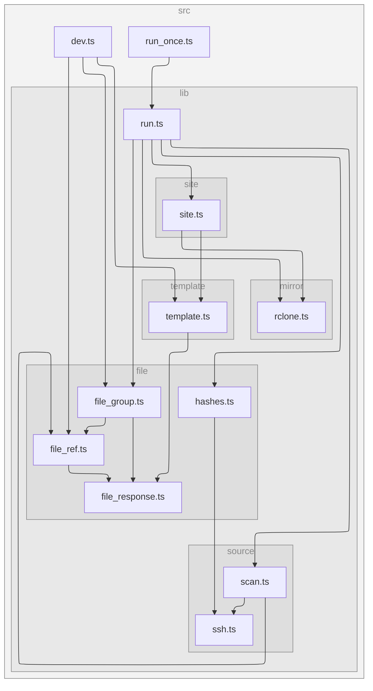

# download.versatiles.org

> [!NOTE]
> This repository is being re-implemented as a standalone, **Node.js-only** updater that
> serves data and the website directly from **Cloudflare R2** (see
> [issue #22](https://github.com/versatiles-org/download.versatiles.org/issues/22)).
> The previous NGINX/WebDAV serving stack has been removed.

[](https://codecov.io/gh/versatiles-org/download.versatiles.org)
[](https://github.com/versatiles-org/download.versatiles.org/actions/workflows/ci.yml)

## Project Outline

This repository powers **<https://download.versatiles.org>** — the public distribution
endpoint for VersaTiles datasets.

It is a **batch updater** (not a web server). On each run it:

- scans the Hetzner Storage Box for `.versatiles` files over SSH
- downloads the existing `.md5` / `.sha256` sidecars (or computes & uploads them if missing)
- groups files into datasets and identifies the latest version of each
- mirrors the data files to a **Cloudflare R2** bucket using `rclone` (delta sync)
- builds the website (`index.html`, per-dataset RSS feeds, checksum sidecars, url lists)
  and uploads it to R2

The data and the website are then served **directly from R2** over our own domain — no
reverse proxy in the request path, no per-GB egress fees, and no redirects. A small
[Cloudflare Worker](worker/) provides the `/` → `index.html` routing that R2 custom
domains lack.

## Architecture

```
Hetzner Storage Box  (source of truth — where .versatiles files are produced)
        │
        │   Node.js updater  (manual run on a small persistent host)
        │   1. scan Hetzner for *.versatiles (+ .md5/.sha256 sidecars)   src/lib/source
        │   2. download/compute hashes                                   src/lib/file/hashes.ts
        │   3. mirror changed data → R2  (rclone, S3 API)                src/lib/mirror
        │   4. build the static site (HTML + RSS + sidecars + url lists) src/lib/site
        │   5. upload site → R2          (LAST = atomic publish)
        ▼
Cloudflare R2 bucket  ── custom domain + Worker, $0 egress ──▶  https://download.versatiles.org/…
        │                                                          (data + sidecars + website)
        └──▶ consumed by the versatiles tile-server (resolves <slug> → URL via the convention below)
```

**Atomic publish:** the data files are mirrored *before* the site is uploaded, so the
site never advertises a file that isn't fully present on R2.

## Bucket layout & naming convention

There is no central catalog file — consumers rely on a predictable key convention plus
the sidecars:

- `https://download.versatiles.org/<slug>.versatiles` — stable "latest" key (overwritten in place)
- `…/<slug>.versatiles.md5` and `.sha256` — sidecars (integrity + change detection)
- `…/<slug>.<date>.versatiles` (+ sidecars) — dated archival copies
- website assets (`index.html`, `feed-<slug>.xml`, `urllist_<slug>.tsv`) under their own keys

> ⚠️ Change detection uses the **MD5 from the sidecar**, never the R2/S3 ETag — for
> multipart (multi-GB) uploads the ETag is not the MD5.

## Development (frontend preview)

To work on the HTML/RSS templates you don't need any cloud access:

```bash
git clone https://github.com/versatiles-org/download.versatiles.org.git
cd download.versatiles.org
npm install
npm run dev
```

Then edit [`template/index.html`](template/index.html) and reload `http://localhost:8080`.

## Configuration

The updater is configured via environment variables (see [`.env.sample`](.env.sample)):

| Variable             | Required | Description                                                                 |
| -------------------- | -------- | --------------------------------------------------------------------------- |
| `DOMAIN`             | yes      | Public domain used to build absolute URLs (e.g. `download.versatiles.org`). |
| `STORAGE_URL`        | yes      | SSH target of the Storage Box (`user@host`).                                |
| `SSH_KEY`            | no       | SSH identity file (default `.ssh/storage`).                                 |
| `RCLONE_SFTP_REMOTE` | yes      | Name of the configured rclone SFTP remote (source).                         |
| `RCLONE_R2_REMOTE`   | yes      | Name of the configured rclone S3/R2 remote (destination).                   |
| `R2_BUCKET`          | yes      | Target R2 bucket name.                                                      |
| `RCLONE_BIN`         | no       | Path to the rclone executable (default `rclone`).                           |

The host also needs `rclone` installed with the two remotes configured in `rclone.conf`
(an SFTP remote for Hetzner and an S3 remote for R2).

## Running the updater

The updater is a one-shot job, **triggered manually** on a small persistent host near the
data (not GitHub Actions — a single multi-TB file would exceed runner limits):

```bash
npm run once
```

It exits non-zero on failure, so it is easy to wrap in monitoring/alerting. For the very
first sync, do the initial multi-TB bulk copy by hand with `rclone copy` (and verify with
`rclone check`); subsequent runs only transfer the deltas.

## Cloudflare Worker

The site root routing, range/resume and CORS handling live in [`worker/`](worker/). See
[`worker/README.md`](worker/README.md) for deployment.

## Verification checklist

After a deploy / cutover, confirm:

- [ ] `https://download.versatiles.org/` returns the HTML index (Worker `/ → index.html`)
- [ ] `https://download.versatiles.org/<slug>.versatiles` streams the bytes directly (HTTP 200, **no redirect**)
- [ ] HTTP range/resume works: `curl -r 0-1023 …/<slug>.versatiles` returns `206 Partial Content`
- [ ] sidecars resolve: `…/<slug>.versatiles.md5` and `.sha256`
- [ ] browser `fetch()` works cross-origin (CORS headers present)
- [ ] `Content-Type` of `.versatiles` objects is `application/octet-stream`

## Available Scripts

- **`npm run check`**: Runs both linting and testing.
- **`npm run dev`**: Starts the local template preview server.
- **`npm run lint`**: Lints the codebase with ESLint.
- **`npm run once`**: Runs the updater once (`run_once.ts`).
- **`npm run test`**: Runs the test suite with Vitest.
- **`npm run test-coverage`**: Runs tests with a coverage report.
- **`npm run upgrade`**: Updates dependencies.

## Running Tests

The project uses **Vitest** for unit tests.

```bash
npm test            # run the suite
npm run test-coverage   # with coverage
```

## Code Structure Overview

- **`src/lib/source/`** — SSH/SFTP helpers and the remote file scan (`scan.ts`, `ssh.ts`).
- **`src/lib/file/`** — core domain types: `FileRef`, `FileGroup`, `FileResponse`, hash/sidecar handling.
- **`src/lib/mirror/`** — the `rclone` wrapper that mirrors data and uploads objects to R2.
- **`src/lib/template/`** — HTML + RSS rendering with Handlebars.
- **`src/lib/site/`** — builds and uploads all site objects to R2.
- **`src/lib/run.ts`** — orchestrates the whole pipeline.
- **`src/run_once.ts`** — manual one-shot entry point.
- **`src/dev.ts`** — local server that renders templates with dummy data.
- **`template/`** — Handlebars templates for HTML and RSS.
- **`worker/`** — the Cloudflare Worker that fronts the R2 bucket.

## Contributing

Contributions are welcome! Please submit a pull request or open an issue for any
improvements or bugs you find.

## Dependency Graph

<!--- This chapter is generated automatically --->



## License

This project is licensed under the MIT License.
